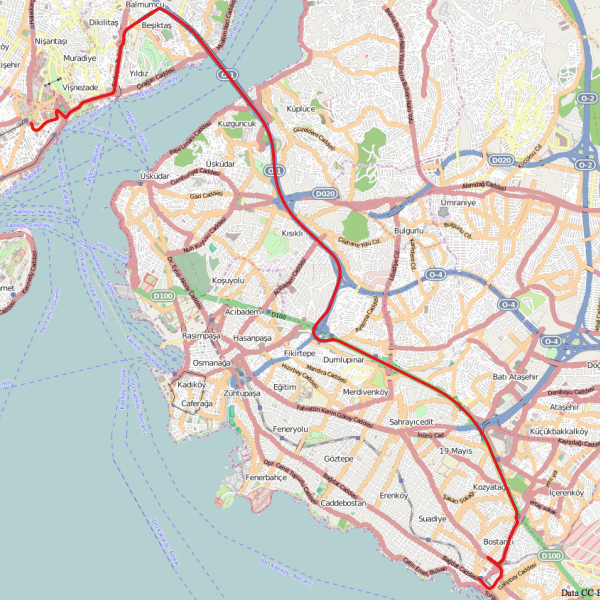
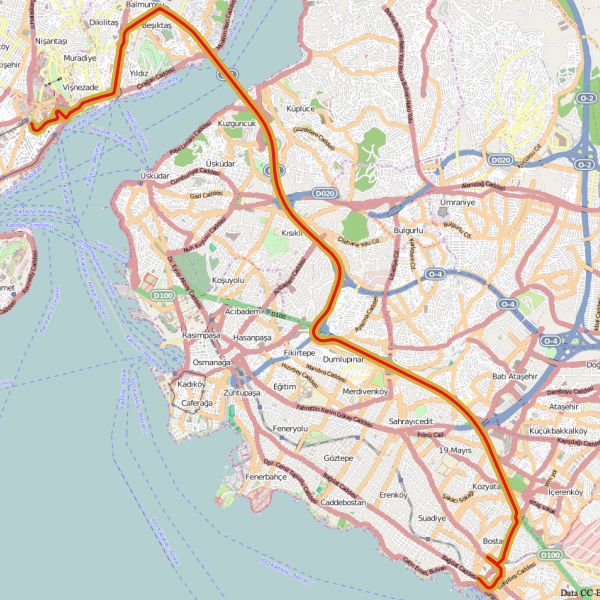
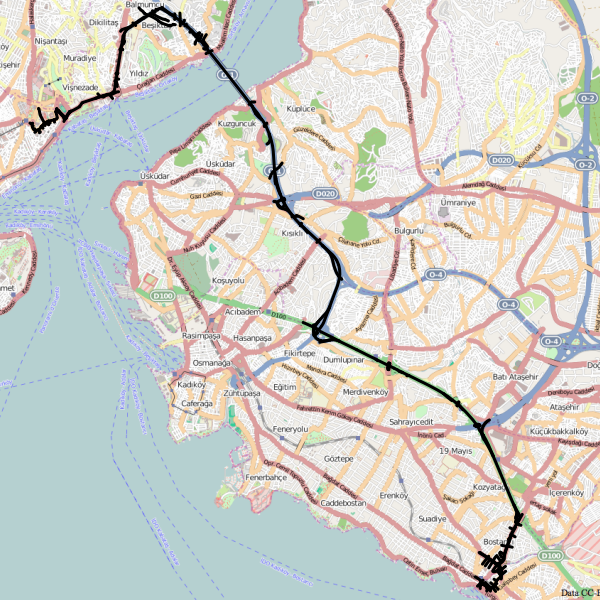

# OSM Map Matcher
OSM Map Matcher matches GPS coordinates to existing OSM highways. Currently it returns solely the id of the matched highways.

## Requires
* python-gdal

## Data Preperation
1. import GPS track
```
ogr2ogr -f "PostgreSQL" PG:"host=localhost user=ustroetz dbname=test" sample.geojson
```



2. buffer GPS track
```
CREATE TABLE bufferGPS AS SELECT ogc_fid, ST_Transform(ST_Buffer(wkb_geometry,10),4326) FROM ogrgeojson
```


3. intersect GPS buffer with roads
```
CREATE TABLE OSMextract AS
SELECT
    a.id,
    b.geom_way
FROM
    osm_2po_4pgr as a,
    bufferGPS as b
WHERE
    ST_Intersects(a.geom_way,b.st_transform);
```


## Run script
```
python OSMmapMatcher.py
```
Matching Results currently only list with OSM segment IDs


## Background
Marchal,F., Hackney, J. and K.W. Axhausen (2005) "Efficient map-matching of large GPS data sets - Tests on a speed monitoring experiment in Zurich". Presented at TRB annual meeting, Washington D.C., Jan. 2005, to appear in Transportation Research Record.
http://www.strc.ch/conferences/2005/Marchal.pdf
